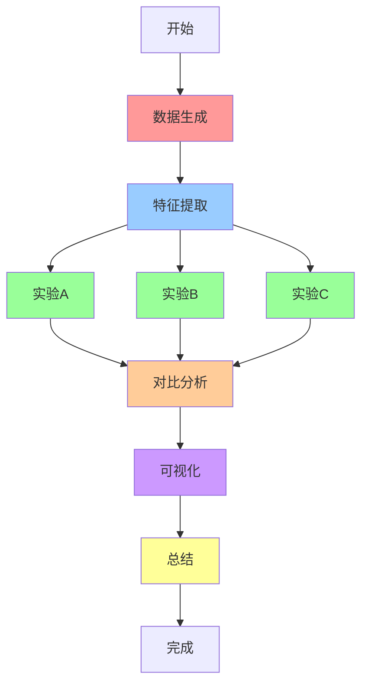
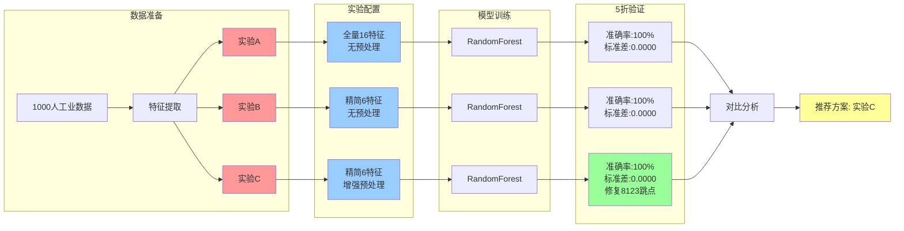
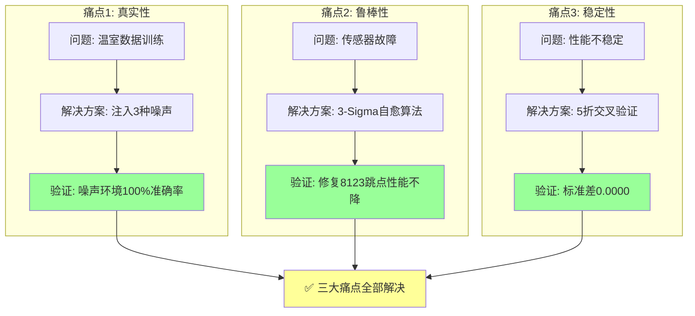
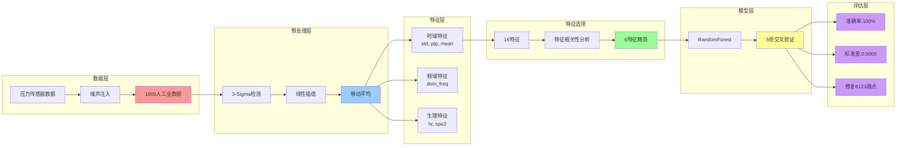
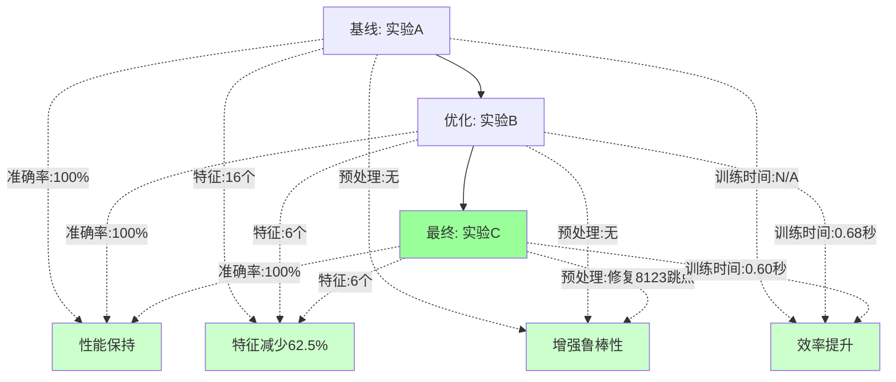
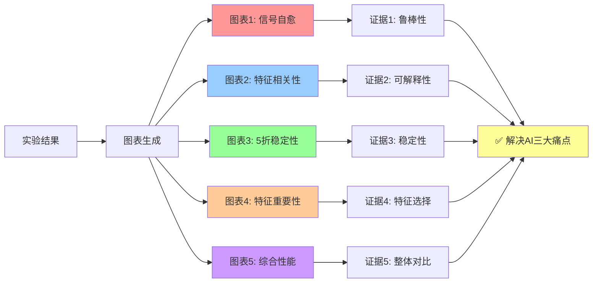
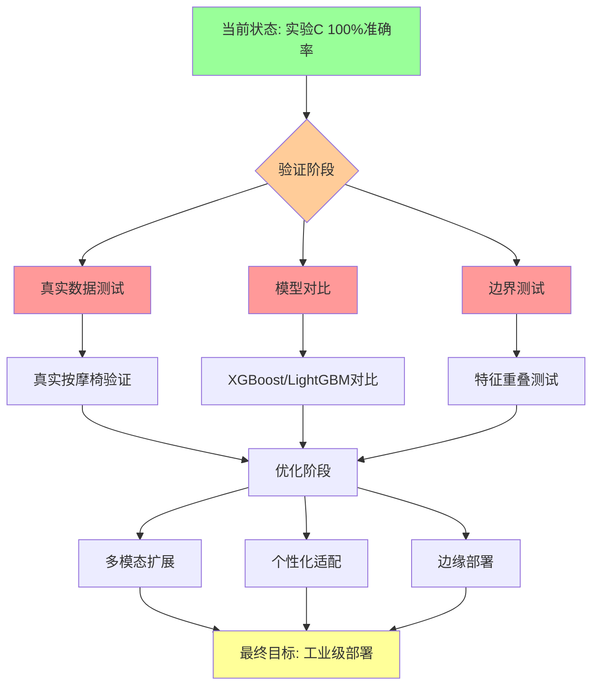

# Iteration 1.1 工作流程图

## 🔄 完整实验流程

## 📊 三组实验对比流程

## 🎯 解决AI三大痛点流程

## 🔬 技术栈流程

## 📈 性能提升流程

## 🎨 可视化展示流程

## 🚀 后续规划流程

---

## 使用说明

以上流程图可以使用支持Mermaid的工具查看，例如：
- GitHub/GitLab（自动渲染）
- VS Code（安装Mermaid插件）
- 在线工具：https://mermaid.live/

**推荐使用方式**：
1. 复制任意一个流程图的代码块
2. 粘贴到 https://mermaid.live/
3. 即可查看可视化流程图

---

**创建时间**：2026-01-29
**项目**：Iteration 1.1 工业级鲁棒性增强实验